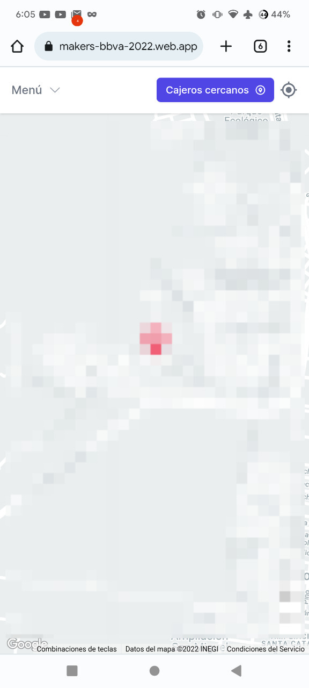

# Notas para evaluadores

El sitio es accesible desde https://troublemakers-bbva-2022.web.app

Para poder obtener los cajeros cercanos en la pantalla principal, se deben otorgar permisos de ubicación al momento de entrar


Las alertas se muestran por cajero. Para poder comprobar la funcionalidad se debe dar click en alguna ubicación de cajero y se mostrarán las alertas. Otro usuario (o desde otro navegador) deberá crear una alerta **en el mismo cajero** para que se refleje el cambio en tiempo real

#### ¿Cómo instalar la app?

Para instalar el sitio como una app, se requiere utilizar Chrome para Android.

Primero se debe acceder al sitio



Después dar click el menú de opciones y seleccionar *Instalar app*


Una vez instalada aparecerá una notificación


Y ya puede usarse como una app más


#### Chatbot

Para poder usar el chabot sin problemas, se requieren los permisos de ubicación.

Para usar el modo *"conducción"* se requieren los permisos del micrófono


# ATM Easy Finder

*Un cajero BBVA cerca de ti*

ATM Easy Finder es una web app progresiva enfocada al tiempo y experiencia del usuario. En esta tienes la facilidad de conectar con los cajeros automaticos de BBVA. Con la posibilidad de ver cajeros cercanos, interactuar con un chat bot con la funcionalidad de asistente de voz, reecibir y crear alertas sobre cajeros, tener proyecciones de fallas y lo máß importante dar una mejor experiencia al usar BBVA.

# Contenido

- [Notas para evaluadores](#notas-para-evaluadores)
      - [¿Cómo instalar la app?](#cómo-instalar-la-app)
      - [Chatbot](#chatbot)
- [ATM Easy Finder](#atm-easy-finder)
- [Contenido](#contenido)
- [Video](#video)
- [Servicios](#servicios)
- [Tecnologías](#tecnologías)
- [Arquitectura](#arquitectura)
- [Screenshots](#screenshots)
    - [Inicio](#inicio)
    - [Responsive](#responsive)
    - [Chatbot](#chatbot-1)
    - [Info Cajero](#info-cajero)
    - [Ruta](#ruta)
    - [Crear Alerta en tiempo real](#crear-alerta-en-tiempo-real)
    - [Ver alertas en tiempo real](#ver-alertas-en-tiempo-real)
- [Autores](#autores)
- [Instalación](#instalación)
    - [1. Moverse a nueva carpeta (Opcional)](#1-moverse-a-nueva-carpeta-opcional)
    - [2. Moverse a la carpeta](#2-moverse-a-la-carpeta)
    - [3. Clonar el repositorio](#3-clonar-el-repositorio)
    - [4. Instalar pnpm](#4-instalar-pnpm)
    - [5. Instalar dependencias](#5-instalar-dependencias)
    - [6. Agregar variables de entorno](#6-agregar-variables-de-entorno)
    - [7. Incia el servidor en modo desarrollo](#7-incia-el-servidor-en-modo-desarrollo)

# Video

[](video)

# Servicios

- :atm: Ver cajeros cercanos y como llegar
- :robot: Chatbot con la funcionalidad de asistente de voz
- :warning: Alertas en tiempo real
- :raising_hand: Crear alertas y sugerencias
- :star: Una mejor experiencia de usuario

# Tecnologías

- Typescript / Javascript
- Vue
- Google Maps Javascript API
- Firebase Firestore
- Firebase Hosting
- Socket.io
- Express.js
- Google Cloud BigQuery
- Google Cloud Dialogflow CX
- Google Cloud App Engine Flex

# Arquitectura


# Screenshots

### Inicio


### Responsive


### Chatbot


### Info Cajero


### Ruta 


### Crear Alerta en tiempo real


### Ver alertas en tiempo real


# Autores

- [@devleon00](https://www.github.com/devleon00) - Juan Pablo Muñiz 
- [@unscatty](https://github.com/unscatty) - Carlos Aguilera
- Alma Ramírez

# Instalación

### 1. Moverse a nueva carpeta (Opcional)
```bash
mkdir troublemakers-bbva-2022
```
### 2. Moverse a la carpeta
```bash
cd troublemakers-bbva-2022
```
### 3. Clonar el repositorio
```bash
git clone https://github.com/unscatty/troublemakers-bbva-2022
```
### 4. Instalar pnpm
```bash
npm i -g pnpm
```

### 5. Instalar dependencias
```bash
pnpm install
```

### 6. Agregar variables de entorno
Crear un archivo `.env.local` y rellenar los siguientes campos

```
VITE_GOOGLE_MAPS_API_KEY=''

# RecordRTC recorder
VITE_RECORDER_MIME_TYPE='audio/webm'
VITE_RECORDER_SAMPLE_RATE=44100
VITE_RECORDER_DESIRED_SAMPLE_RATE=16000
VITE_RECORDER_AUDIO_CHANNELS=1

# Server
VITE_SERVER_ENDPOINT=''
VITE_SERVER_SOCKET_ENDPOINT=''

# Firebase config
VITE_FIREBASE_API_KEY=''
VITE_FIREBASE_AUTH_DOMAIN=''
VITE_FIREBASE_PROJECT_ID=''
VITE_FIREBASE_STORAGE_BUCKET=''
VITE_FIREBASE_MESSAGING_SENDER_ID=''
VITE_FIREBASE_APP_ID=''
```

### 7. Incia el servidor en modo desarrollo
```bash
pnpm run dev
```


